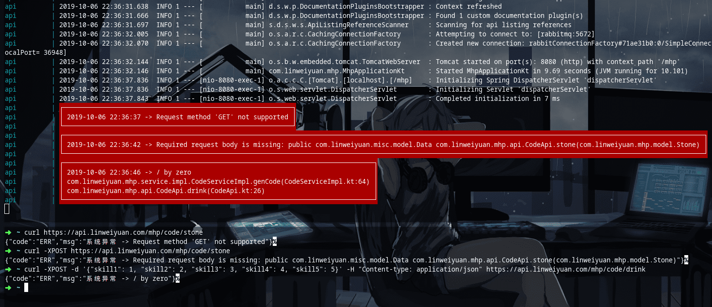

# logger
### ExceptionLogger - 异常输出带颜色

```java
ExceptionLogger.get(); // 获取异常信息
ExceptionLogger.print(e); // 默认输出红色带背景，输出全部
ExceptionLogger.print(e, Color.ANSI_GREEN); // 绿色不带背景，输出全部
ExceptionLogger.print(e, Color.ANSI_GREEN, "org.springframework"); // 绿色不带背景，只输出包含org.springframework，输出全部
ExceptionLogger.print(e, Color.ANSI_GREEN, 5); // 绿色不带背景，只输出5条
ExceptionLogger.print(e, "org.springframework", 5); // 红色带背景，只输出包含org.springframework，只输出5条
ExceptionLogger.print(e, Color.ANSI_GREEN, "org.springframework", 5); // 绿色不带背景，只输出org.springframework的异常堆栈，只输出5条
```


